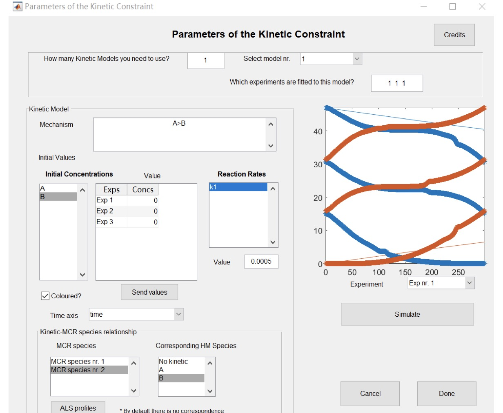

## MCR-ALS

###1. Loader the data

```matlab
filename1='./data/LAC_SUB_1.csv'
D1=csvread(filename1)
D1=D1(:,61:711)
time=0:0.5:298.5

filename2='./data/LAC_SUB_2.csv'
D2=csvread(filename2)
D2=D2(:,61:711)
time=0:0.5:298.5

filename3='./data/LAC_SUB_3.csv'
D3=csvread(filename3)
D3=D3(:,61:711)
time=0:0.5:298.5

filename4='./data/LAC_SUB_TEMPO_1.csv'
D4=csvread(filename4)
D4=D4(:,61:711)
time=0:0.5:298.5

filename5='./data/LAC_SUB_TEMPO_2.csv'
D5=csvread(filename5)
D5=D5(:,61:711)
time=0:0.5:298.5

filename6='./data/LAC_SUB_TEMPO_3.csv'
D6=csvread(filename6)
D6=D6(:,61:711)
time=0:0.5:298.5

D=[D1,D2,D3]
D_T=[D4,D5,D6]
time=0:0.5:298.5
```

*照着PPT从头做 图片并排放*

###Determination of the number of components (SVD) 

###Initial estimation (EFA analysis)

###Row constraints (Non-negativity + Kinetic Models)

###Column constraints (Non-negativity)

###ALS optimization (Iteration:200, convergence criterion:0.1)

###Output (分解矩阵 concentrations + spectra; 残差矩阵)

<table>
    <tr>
        <td ><center> 图片放在./picture文件夹下 </center></td>
        <td ><center>图2 新垣结衣1</center></td>
    </tr>
    <tr>
        <td><center>图3 新垣结衣2</center></td>
        <td ><center>图4 新垣结衣2</center> </td>
    </tr>
    <tr>
        <td><center> 图5 新垣结衣3</center></td>
        <td><center> 图6 新垣结衣3</center></td>
    </tr>
</table>

### n. Plot

*这里就是试一试*

```R
copt <- read.table("../Other/oyxy/output/copt_t.txt")
sopt <- read.table("../Other/oyxy/output/sopt_t.txt")

Residuals <- read.table("residuals.txt")

x1 <- seq(0, 298.5, 0.5)
y11 <- copt[1:598, 1]
y12 <- copt[599:1196, 1]
y13 <- copt[1197:1794, 1]
y1 <- (y11 + y12 + y13) / 3
y21 <- copt[1:598, 2]
y22 <- copt[599:1196, 2]
y23 <- copt[1197:1794, 2]
y2 <- (y21 + y22 + y23) / 3
x2 <- x1
fit1 <- lm(y1 ~ x1)
fit2 <- lm(y2 ~ x2)
plot(x1, y1, xlab = "time", ylab = "concentration", main = "copt (LAC+SUB)", type = "l", ylim = c(-1, 14))
lines(x2, y2, col = "red")
abline(fit1)
abline(fit2, col = "red")

# residual analysis

plot(Residuals[, 1], ylim = c(-0.000003, 0.000003), ylab = "residuals(cols)")

for (i in c(1:10)) {
    points(Residuals[, i * 20])
}

plot(t(Residuals)[, 1], ylim = c(-0.000003, 0.000003), ylab = "residuals(rows)")

for (i in c(1:29)) {
    points(t(Residuals)[, i * 60])
}
```

